# Chart & Report Inventory

## Purpose:
To provide a comprehensive suite of charts and reports for visualizing and analyzing loan application data, risk
assessments, and portfolio performance in a business intelligence context.
This inventory serves as a reference for developers and analysts to select appropriate visualization tools for their data analysis needs.

## Usage:
	Integrate these charts and reports into web applications or dashboards for enhanced data insights.
	Customize visualizations based on specific business requirements and datasets.

## Technologies Used:
	JavaScript (D3.js, Chart.js, Ploty.js, Leaflet.js)
	HTML5 & CSS3
	Data Visualization Libraries
	Responsive Design Principles

## Charts Types:
 3D Surface Plots - Risk landscape visualization 
	<a href="#" title="RiskLandscape3D">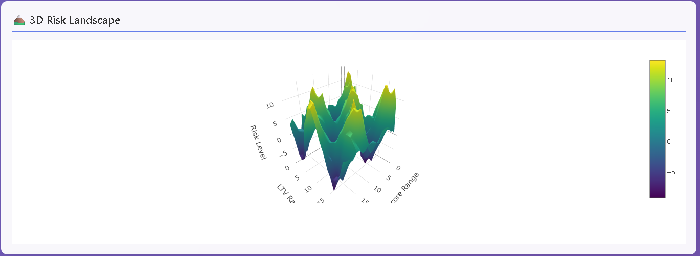</a>  

 Area Charts - Loan origination trends  
 	<a href="#" title="LoanOriginationTrends">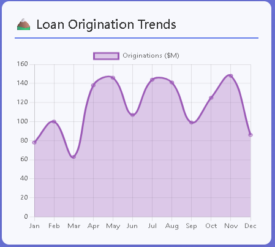</a>  

 Bar Charts - Loan applications by status  
	<a href="#" title="LoanApplicationByStatus">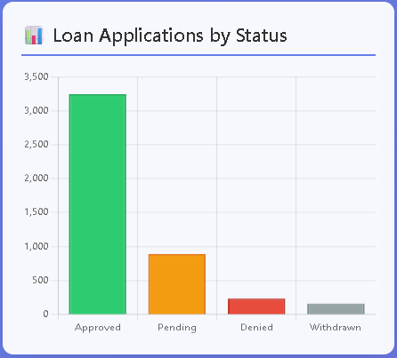</a>  
		
 Box Plots - Interest rate distribution by product 
 <a href="#" title="InterestRateDistributionByProduct">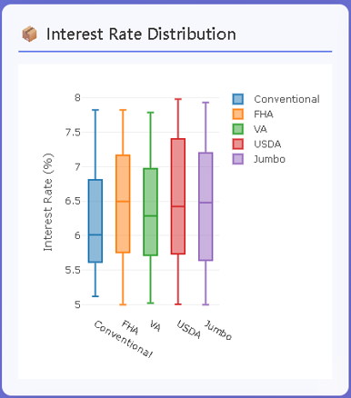</a>  

 Bubble Charts - Portfolio bubble analysis 
 <a href="#" title="PortfolioBubbleAnalysis">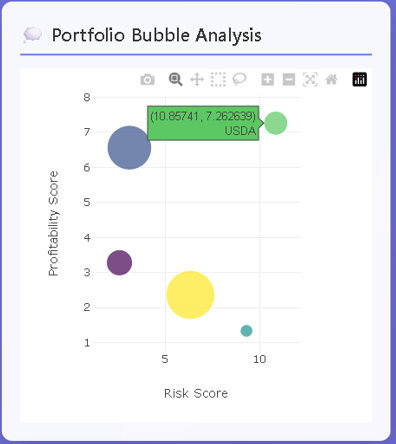</a>  

 Candlestick Charts - Interest rate OHLC analysis 
   

 Column Charts - Monthly application volume  
	<a href="#" title="MonthlyApplicationVolume">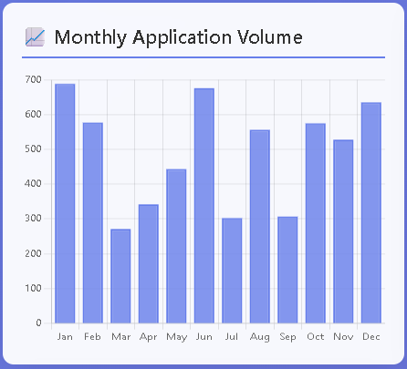</a>  

 Donut Charts - Risk classifications  
	<a href="#" title="RiskClassifications">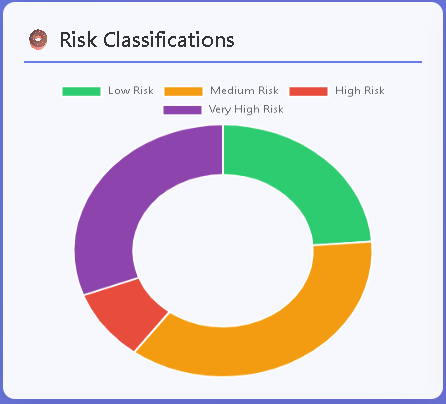</a>  

 Funnel Charts - Application conversion funnel 
   

 Gauge Charts - Portfolio health score 
 <a href="#" title="PortfolioHealthScore">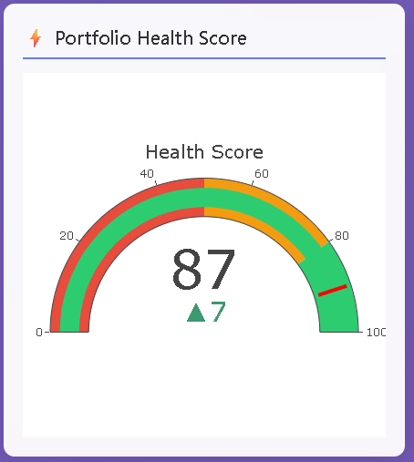</a>  

 Heatmaps - Risk assessment matrix (LTV vs DTI) 
 <a href="#" title="RiskAssessmentMatrix">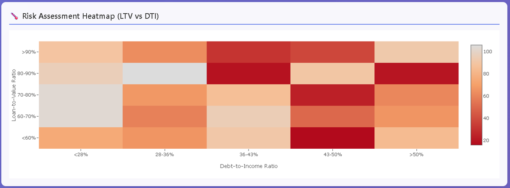</a>  

 Histograms - Loan amount distribution 
 <a href="#" title="LoanAmountDistribution">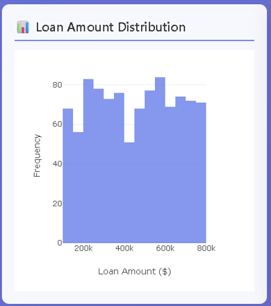</a>  

 Line Charts  
	<a href="#" title="InterestRatesTrends">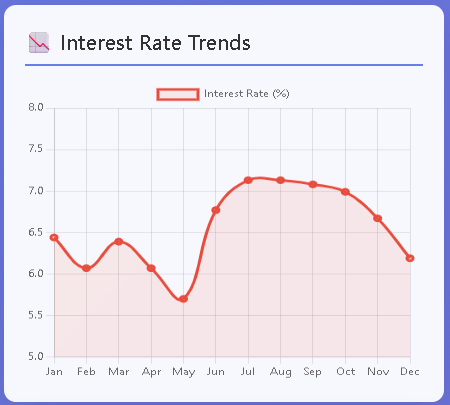</a>  
		
 Parallel Coordinates - Multi-dimensional risk analysis 
 <a href="#" title="MultiDimensionalRiskAnalysis">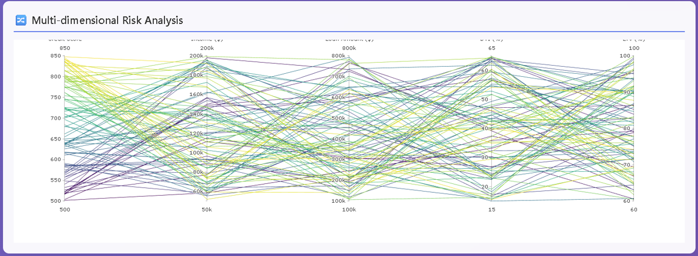</a>  

 Pie Charts - Loan types distribution  
 <a href="#" title="LoanTypesDistribution">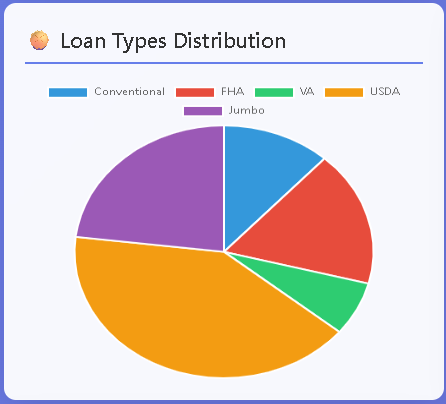</a>  

 Polar Area Charts - Seasonal application trends  
	<a href="#" title="SeasonalApplicationTrends">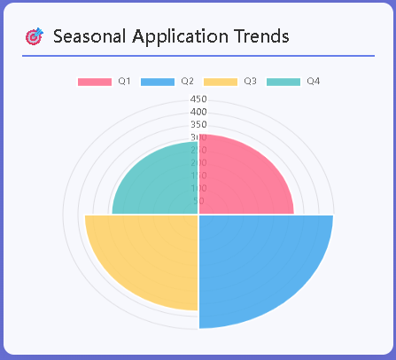</a>  

 Radar Charts - Loan officer performance metrics  
 	<a href="#" title="LoanOfficerPerformance">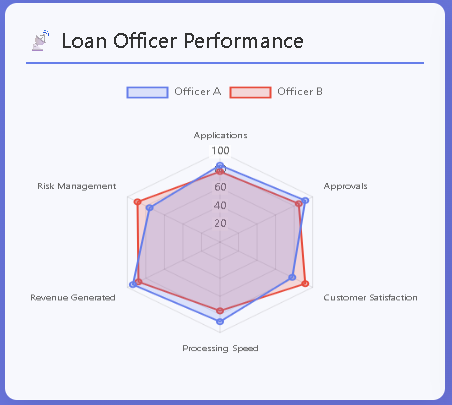</a>  

 Scatter Plots - Credit score vs loan amount 
 <a href="#" title="CreditScoreVsLoanAmount">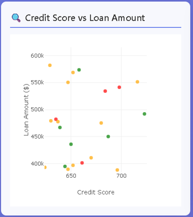</a>  

 Sunburst Charts - Hierarchical portfolio breakdown 

 Treemaps - Loan portfolio composition 
 <a href="#" title="LoanPortfolioComposition">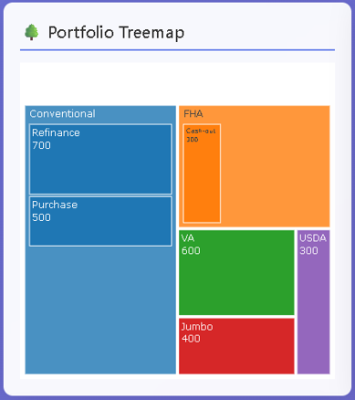</a>  

 Violin Plots - Payment distribution patterns 
 <a href="#" title="PaymentDistributionPatterns">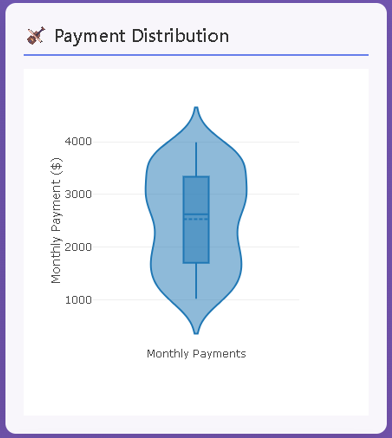</a>&nbsp; <a href="#" title="PaymentDistributionPatterns1">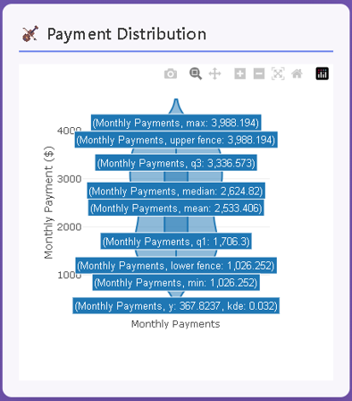</a>  

 
## Specialized Visualizations:
 Chord Diagrams - Customer-officer relationships 
 <a href="#" title="CustomerOfficerRelationships">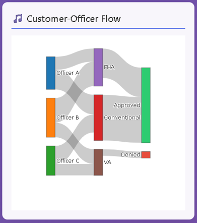</a>  

 Gantt Charts - Loan processing timeline 
 <a href="#" title="LoanProcessingTimeline">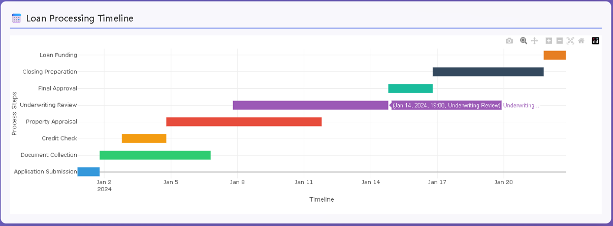</a>  

 Geospatial Maps - Geographic loan distribution by state 

 Network Diagrams - Servicer network relationships 
    

 Sankey Diagrams - Application process flow 
 <a href="#" title="ApplicationProcessFlow">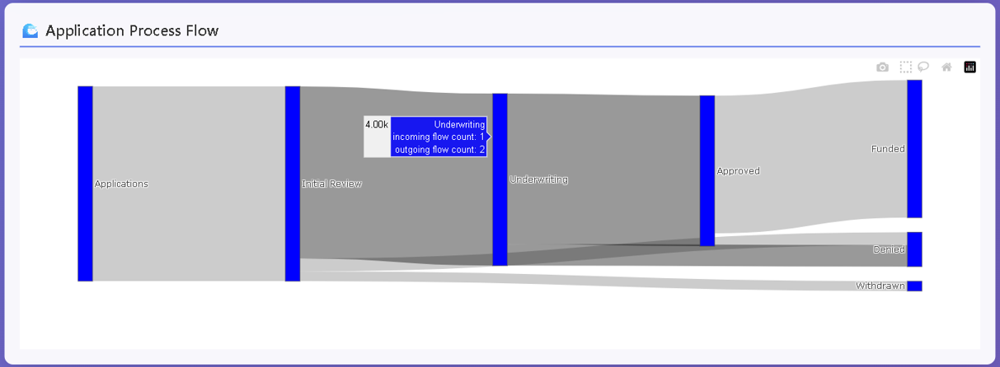</a>  

 Waterfall Charts - Revenue breakdown analysis 
  <a href="#" title="RevenueBreakdownAnalysis">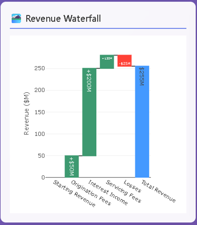</a>  

 Word Clouds - Common denial reasons 
 <a href="#" title="CommonDenialReasons">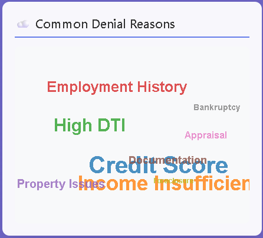</a>  

## Reports & Infographics:
 Infographics - Key performance statistics with icons 
 <a href="#" title="KeyPerformanceStatistics">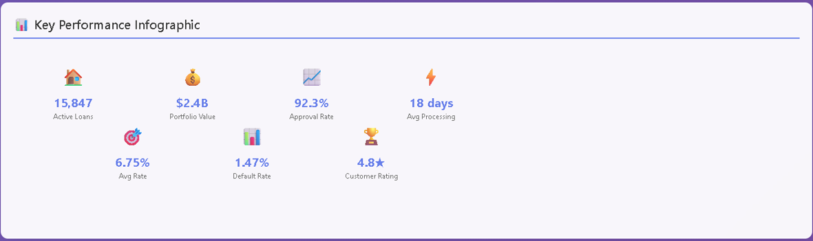</a>  

 KPI Dashboard - Real-time key performance indicators 
 <a href="#" title="KPIDashboard">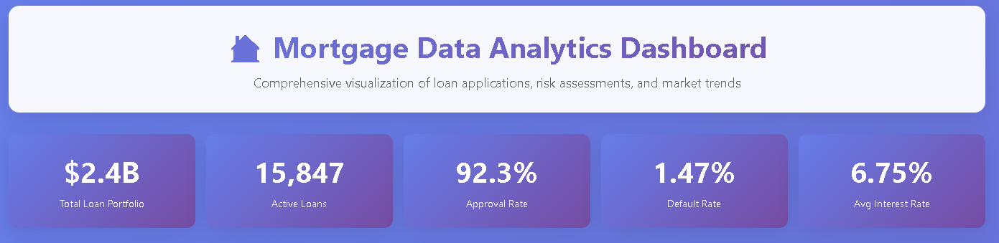</a>  

 Labels Reports - Dynamic data labels with interactive cards 
 <a href="#" title="DynamicDataLabels">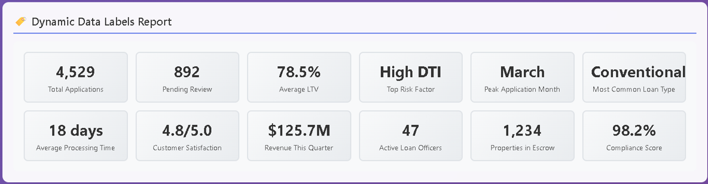</a>  

## 🎯 Key Features Added:

### Interactive Elements:
Hover effects on all charts
Tooltips with detailed information
Clickable label cards with animations
Network simulation with force-directed layout

###Advanced Analytics:

Multi-dimensional analysis with parallel coordinates
3D risk visualization with surface plots
Hierarchical data with sunburst charts
Financial analysis with candlestick patterns

## Professional Reporting:

Executive dashboard with KPIs
Operational metrics with gauges
Process flow visualization
Geographic intelligence mapping

